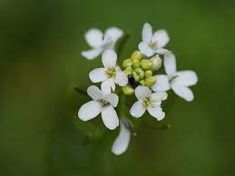
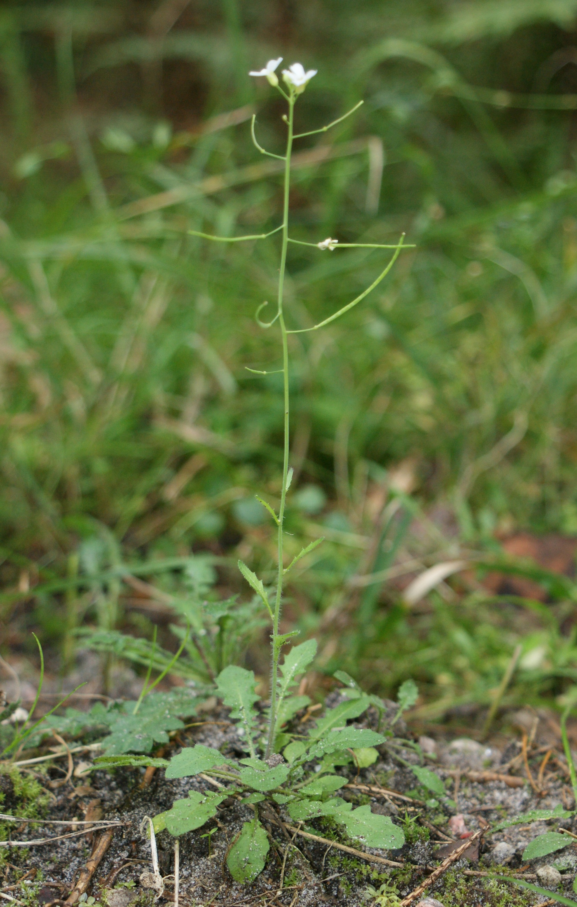
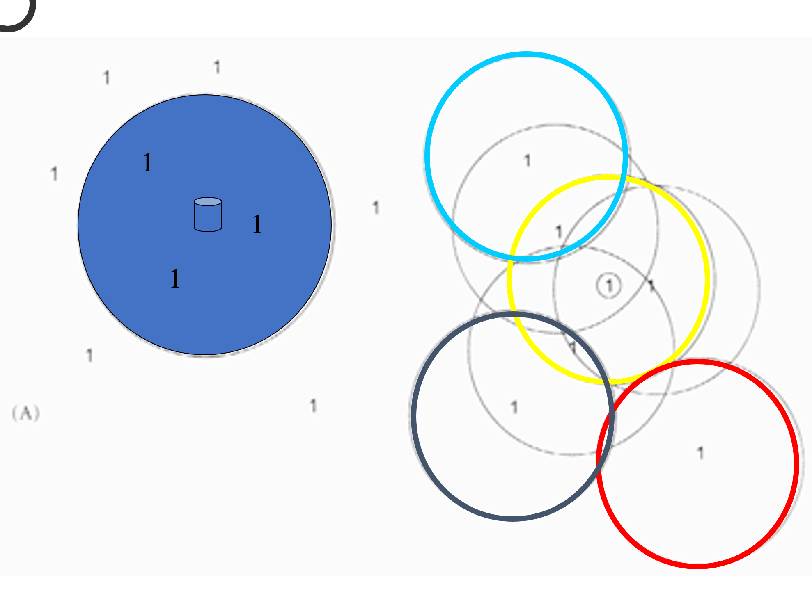
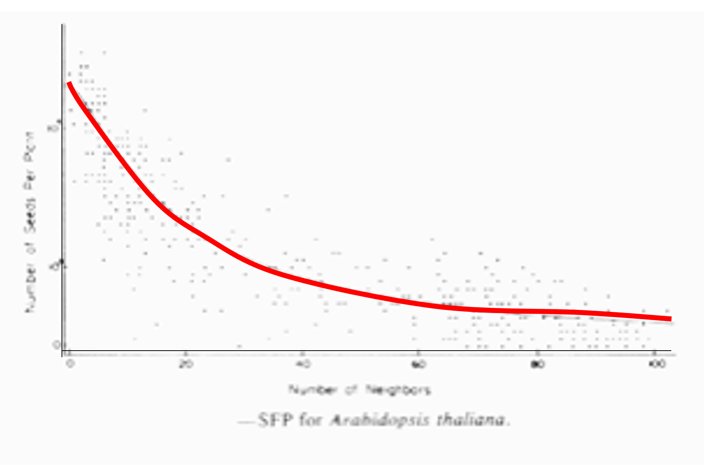

```{r setup, include=FALSE}
knitr::opts_chunk$set(echo = TRUE)
```


# Competencia Intra-específica

Definición: La compentencia intra especifica se refiere a la interacciones que hay entre los individuos de una misma especia donde una escases de recursos que sea espacial, nutricional o reproducción.  

En esta clase exploraremos cómo los conceptos de Ecología de poblaciones se pueden aplicar a sistemas del mundo real para apoyar y mejorar la conservación y el manejo de la vida silvestre. Esta estrechamente relacionada con la Biología de la conservación, la ecologia de población que incluye la compentencia intra-especifica.  

El efecto de competencia en una especie por cause de variación en densidad y recursos limitados, son:

  - aumento en mortandad
  - reducción en reproducción
  - reducción en tamaño del organismo
  - crecimiento más lento 

***
  
## Visualizar la densidad de individuos en espacio


 

{width=50%}

***

### Diagrama de densidad de planta en un ambiente natural




***





***

## Video de definición del tema

[Video 1 Intra specific competetion](https://www.youtube.com/watch?v=LKT3D27WS6s)


[Video 2 Intra specific competetion](https://www.youtube.com/watch?v=l0pZwBMlA1s)

[Video 3 Intra specific competetion](https://www.youtube.com/watch?v=lk1CQYFzboQ)

***
# Proyecto

## Competencia Intraespecifica 

### Objetivos
  
  - Investigar el efecto de la competencia inytraespecifica en individuos de la especies de Asteraceae. La compentencia ocurre cuando los individuos usan recursos compartidos, por consecuencia en plantas, la densidad de plantas en area es una posible variable que impacta el crecicimento de de las plantas.
  
  
  
  
### Métodos

Recolectar datos sobre la cantidad de individuos por area, y unas variables de adecuación de la plantas (i.e., número de ramas, números de hojas, números de flores).


#### Material de campo
 
 - Cuandrates de $0.5m^2$
 
 Se recolectará la siguiente información
 
 - El número de plantas por cuandrantes
 - El número de tallos por planta
 - El número de inflorescencia por planta.
 
 Cada grupo recolectará información de 15 cuadrante.
 
 ***
 
 
 
 
 
 


