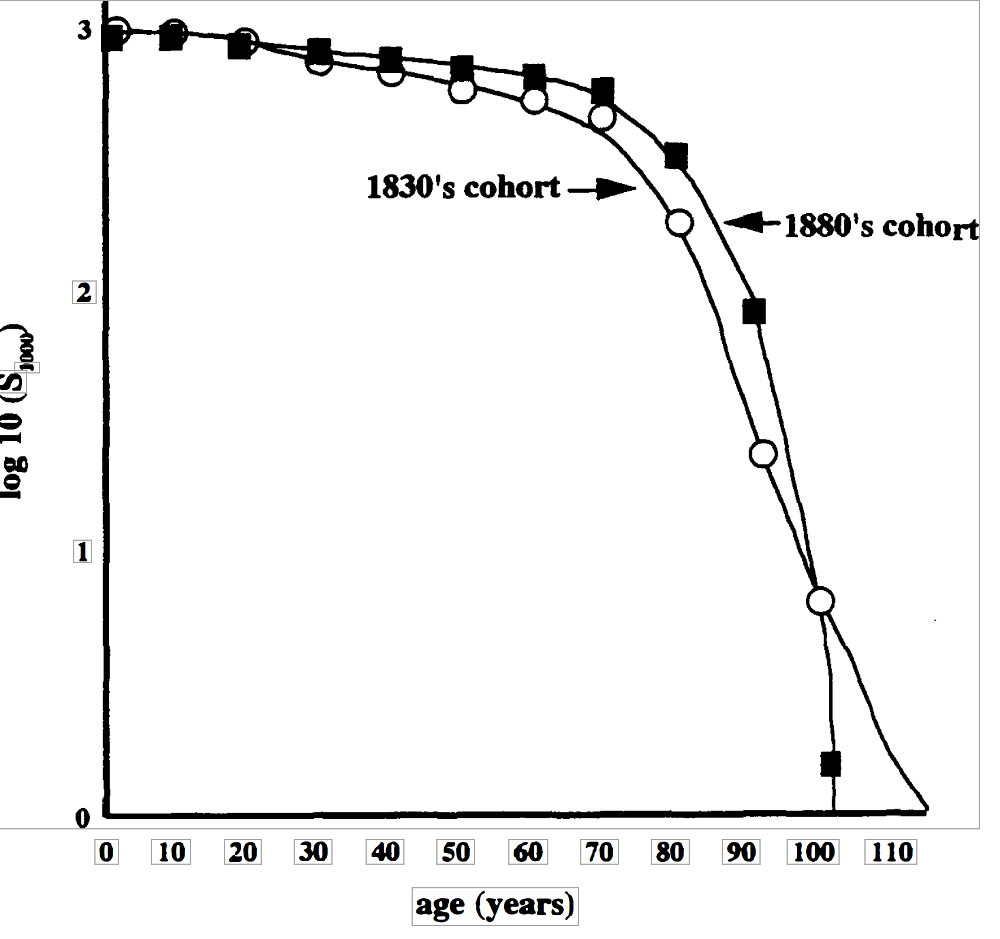

```{r setup, include=FALSE}
knitr::opts_chunk$set(echo = TRUE)
```


## Demografia de cementerios


Este documento es orientado a evaluar la demografia de humanos en diferentes condiciones ambientales o atravez del tiempo o variación genética.

### ESA Lab

El ejercicio abajo es una adpatación del siguiente documento **Ejercico de demografia en Ingles** (vea sección de documentos abajo)

Este ejercicio fue sometido a ESA por Nancy Flood, University of  Toronto, Toronto, Canada y adaptado para los estudiantes del laboratorio de ecología general de la Universidad de Puerto Rico

## Introducción 

A medida que Estados Unidos ha progresado a través de la revolución industrial en los últimos 150 años, los cambios en los estilos de vida de los ciudadanos se han reflejado en su edad al morir. Factores como enfermedades y accidentes han cambiado en sus impactos relativos. Una forma de estudiar estos cambios en los patrones demográficos humanos es visitar un cementerio local y recopilar datos registrados en lápidas.

Al recopilar información sobre el año de la muerte de todos los individuos de la misma clase de edad (una cohorte), puede producir una representación gráfica de su supervivencia. Para este ejercicio, una cohorte incluirá a todos los individuos nacidos durante la misma década.

Para las numerosas especies estudiadas, las curvas generalmente se ajustan a una de tres formas generales (Figura 1). La supervivencia humana normalmente se ajusta a una curva de tipo 1. Especialmente interesante es que se pueden ver diferencias leves, pero distintas, cuando se comparan curvas de comunidades separadas, o cuando se comparan cohortes de diferentes décadas para una sola comunidad, como lo hará durante este laboratorio.


**FIGURA 1**. Tres tipos de curvas de supervivencia: El tipo 1 muestra una mortalidad inicial baja y muchos individuos viven hasta la vejez. El tipo 2 muestra una tasa de mortalidad constante. El tipo 3 muestra una alta mortalidad inicial con pocas personas que viven hasta la vejez.

 *https://www.britannica.com/science/survivorship-curve/images-videos*

***

## Objetivos del laboratorio


  - Compare y explique las diferencias en las curvas de supervivencia de al menos dos cohortes en una comunidad con respecto a la historia local o nacional.

   - Especular sobre cambios futuros en la demografía, con base en los cambios actuales de la comunidad
   
   - Recopilar datos de edad y calcule la supervivencia de al menos dos cohortes en una comunidad o diferentes comunidades. Graficar estos datos para mostrar una curva de supervivencia para grupo que estudiaste.


**FIGURA 2**. Curvas de supervivencia para las décadas de 1830 y 1880 en Newberry, Carolina del Sur.




***

Metodos y materiales

 - Seleccione al menos dos cohortes específicas (definidas como una década para este estudio) en un cementerio de su comunidad. Debido a que seguirá a todas las personas nacidas durante estas décadas, debe elegir dos que sean anteriores a la década de 1890. ¿Por qué?
 - Registre el año de nacimiento y el año de muerte de cada individuo en la Tabla 1. Necesita datos de AL MENOS 100 individuos. Su instructor puede pedirle que recopile más datos o que distinga entre hombres y mujeres.

***

Analisis de datos

 - Para cada individuo calcular la edad al morir (Tabla 1).

 - Resuma los datos en la Tabla 2. Tenga en cuenta que los datos están agrupados en clases de edad (primera columna) de intervalos de diez años. Para la clase de edad de 0 a 9 años, cuente todas las personas que murieron a la edad de 9 años o menos. Continúe registrando el número de muertes para cada una de las clases de edad. El número de muertes para una clase de edad se abrevia comúnmente como "dx'. Cuando llegue al final de la columna, determine el número total de muertes y registre este número en el espacio indicado. Este número debe ser igual al número total de lápidas que contaste para esa década.
 
 - La tercera columna es para datos de supervivencia lx) y los cálculos de estos datos son acumulativos. Comience colocando un cero (0) en el casillero más bajo de la columna. Para determinar el número de la siguiente casilla sume al cero el número de muertes (dx) que aparece en la columna de la izquierda y una fila hacia arriba. Continúe este proceso de sumar el número a la izquierda y una fila hacia arriba para determinar los datos de cada fila de la columna de supervivencia. Cuando llegues a la cima, deberías tener el número total de lápidas que contaste originalmente. (Consulte la Tabla 3 para ver un ejemplo de datos determinados de esta manera).
 
- Estandarice los datos de supervivencia por 1000 (S1000) para permitirle comparar los datos de las dos décadas. Utilice la ecuación de la página siguiente para realizar los cálculos necesarios.

    - supervivencia por 1000 = total de lápidas contadas x 1000
    - Para verificar que sus cálculos sean correctos, la línea superior debe ser 1000 y la línea inferior cero.

 - Para estandarizar sus datos para graficar, calcule el logaritmo en base diez (10) de cada número en la columna "supervivencia por 1000". Una vez más, para verificar sus cálculos, el número en la fila superior debe ser 3 y la línea inferior producirá un error (el registro O no está definido) en su calculadora. Para este número simplemente ponga "0".
 
 - Trace sus datos con el eje x que representa el tiempo y el eje y que representa el logaritmo de la proporción de personas que sobreviven. Usa papel cuadriculado o el espacio provisto después de la Tabla 2. Compara tus datos con las Figuras 1 y 2.
 
***

## Preguntas

 - ¿Las curvas para las diferentes décadas difieren entre sí? En ese caso, ¿Qué pudo haber causado las diferencias?
 
  - ¿Cómo se comparan sus gráficos con la Figura 1, curvas de supervivencia para diferentes tipos de poblaciones y con la Figura 2, curvas de supervivencia para los dos grupos ¿Puede explicar alguna diferencia?
  
  
***

### Tabla de recolección de datos, Ejemplo
  
```{r warning=FALSE, include=FALSE}
library(tidyverse)
library(gt)
```
  

Aqui expande sus datos a incluir 150 personas por sitios/grupos

```{r}
Mis_Datos_sitio_1= tribble(
  ~Num_Ind, ~Año_Naci, ~Año_Fallecio, ~Edad_Fallacer, ~Genero,
  1, 1898, 1899, 1, "M",
  2, 1867, 1967,100,"F",
  3,  NA   ,  NA ,NA , ".",
  150,1890,1945,55,"M"
)

gt(Mis_Datos_sitio_1)
```

***

# Resumir los datos en una table

```{r}
Resumir_datos= tribble(
  ~"Classes de Edad", ~"Num_muerto en esa clase, dx", ~"Supervivencia de natalidad, lx", ~"Supervivencia por 1000", ~"Log10",
  "0-9", NA, NA, NA, NA,
  "10-19", NA, NA,NA,NA,
  "20-19",  NA   ,  NA ,NA , NA,
  "90+",NA,NA,NA,NA
)

gt(Resumir_datos)
```

***


Ejemplo de una tabla de vida con 160 personas en un cohorte


```{r}
Resumir_datos2= tribble(
  ~"Classes de Edad", ~"Num_muerto en esa clase, dx", ~"Supervivencia de natalidad, lx", ~"Supervivencia por 1000", ~"Log10",
  "0-9", 8, 160, 1000, 3.00,
  "10-19", 7, 152,950,2.98,
  "20-29",  13   ,  145 ,906 , 2.96,
  "30-39", 9,132,825,2.95,
  "40-49",13,123,469,2.89,
  "50-59",21,110,688,2.84,
  "60-69",23,89,556,2.75,
  "70-79",39,66,413,2.62,
  "80-89",22,27,169,2.23,
  "90-99",4,5,31,1.49,
  "100+",0,0,6,0
)

gt(Resumir_datos2)
```

***

### Uno de los problema 

Un problema con el estudio de las curvas de supervivencia es que se debe seguir una cohorte de nacimiento hasta la muerte del último individuo. ¿Cómo se alteraría la curva de supervivencia de 1940 con respecto a la de 1800?

### Especulaciones

 - Especula sobre el futuro si:
   - El Covid-19 sigue aumentando y no se encuentra cura.
   - Los avances médicos continúan y se eliminan la mayoría de las enfermedades y la mortalidad infantil.
   - Se agravan los problemas ambientales y aumentan las enfermedades relacionadas con la contaminación.

### Seleción de datos

Para seleccionar sus datos y crear una hipótesis vea el documento  **Demography from Physical cemeteris** en este documento encontrarán enlaces a bases de datos de cementerios por todo el mundo.


***

### Documentos

[Ejercico de demografia en Ingles](PDF/Cemetery_Demography.pdf)

[Demography from Physical cemeteris](PDF/Cementary lab.pdf)

[Presentación sobre demografia](PDF/10_Population growth.pdf)


***

### Referencias suplementarias

REFERENCES

Condran, G. and E. Crimmins. 1980. Mortality differentials between rural and urban areas of states 
in the northeastern United States 1890-1900. Journal of Historical Geography 6 (2): 179-202. Dethlefsen, E. S. and K. Jensen. 1977. Social commentary from the cemetery. Natural History 86(6) 
32-39.

Gwatkin, D. R. and S. K. Brandel. 1982. Life expectancy and population growth in the third world. 
Scientific American 246 (5): 57-65. 

Kuntz. S. 1984. Mortality change in America, 1620-1920. Human Biology 56: 559-582. 

Mahler, H. 1980. People. Scientific American 243 (3): 67-77. 