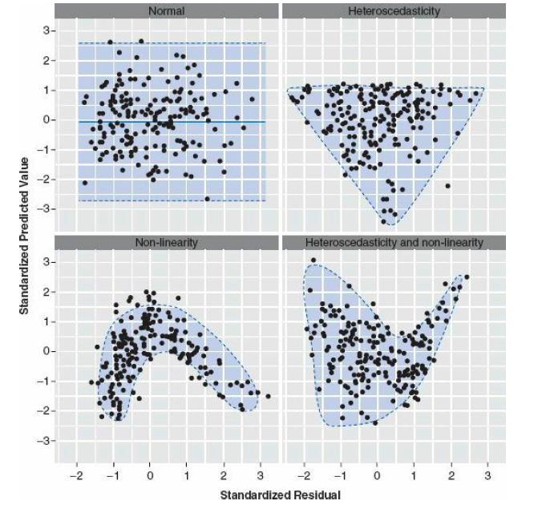

```{=html}
<style>
.list-group-item.active, .list-group-item.active:focus, .list-group-item.active:hover {
    background-color: #437d66;
}
</style>
```
```{r setup, include=FALSE}
knitr::opts_chunk$set(echo = TRUE)
```

```{r, echo=FALSE, fig.show = "hold", out.width = "50%", fig.align = "default"}
knitr::include_graphics(c("Graficos/Analitica.png", "Graficos/UPR_IPERT_logo.png"))
```

```{r, echo=FALSE}
colorize <- function(x, color) {
  if (knitr::is_latex_output()) {
    sprintf("\\textcolor{%s}{%s}", color, x)
  } else if (knitr::is_html_output()) {
    sprintf("<span style='color: %s;'>%s</span>", color, 
      x)
  } else x
}

#`r colorize("some words in red", "red")`
```

------------------------------------------------------------------------

```{r, message=FALSE}

if (!require("pacman")) install.packages("pacman")
pacman::p_load(QuantPsyc, car, tidyverse, sjPlot)


library(QuantPsyc)
library(car)
library(ggplot2)
library(tidyverse)
library(sjPlot)
```

------------------------------------------------------------------------

# Regresión Polinomial

Si la gráfica de residuos de la regresión lineal indica una distribución no aleatoria del error de predicción del modelo lineal es posible que pueda mejorar su predicción utilizando una regresión con un término cuadrático (es decir, $X^2$), por lo que ahora tenemos una **regresión con un polinomio.**

Construcción de un modelo con polinomio. Usamos los datos de 15 observaciones de mujeres en el archivo **women** en el paquete **datasets**. Los datos representan la altura (en pulgadas) y el peso (en libras) de 15 mujeres entre las edades de 30 a 39.

Nota aquí que se usa **I(x\^2)** para añadir el monomio $x^2$ . Ahora nuestro modelo evaluará el efecto de la regresión lineal y cuadrática. El resumen del modelo se observa que el modelo incluye tanto el intercepto, la ecuación lineal y el término cuadrático, y cada uno es significativo. Esto quiere decir que tanto el modelo lineal como el polinomio explican parte de la varianza. NOTA como se indica que un valor

```{r regr_polyn1}
fit2 <- lm(weight ~ height + I(height^2), data=women)
summary(fit2)
plot(fit2)
```

### Comparar el modelo anterior con el siguiente modelo. En el presente modelo se removio el polinimio. Evaluando los residuales es claro que estos no son distribuido de forma al azar.  Note la curva. Esto es un indicador que no cumple con el supuesto de igualdad de varianza.    

```{r regr_polyn2}
fit2 <- lm(weight ~ height, data=women)
summary(fit2)
plot(fit2$residuals)
```


------------------------------------------------------------------------

## Visualizando el gráfico.

Nota que la linea `r colorize("azul", "blue")` representa el modelo de regresión lineal y la linea `r colorize("roja", "red")` representa el modelo $y \approx ax^2 +bx+c$. Es claro que el modelo $y \approx ax^2+bx+c$ es un mejor modelo ya que los datos se acercan más a la linea.

```{r}
ggplot(women, aes(height, weight)) +
  geom_point(color ="blue", size=2) +
  geom_smooth(method=lm)+
  stat_smooth(aes(), method = "lm", formula = y ~ poly(x,2), 
              color ="red", se =TRUE, size = 1) +
  labs(x="Height, inches", y="Weight, lb.")

```

------------------------------------------------------------------------

## Visualizando los residuales

Recuerda que los residuales tienen que ser normalmente distribuidos a través de la variables de **x**. En este caso vemos que los residuales no están concentrados en un área de la gráfica. Por ejemplo los residuales no son más grande en los valores de **x** más grande.

```{r}

plot(women$height,residuals(fit2),
     xlab="Height (in inches)",
     ylab="residuals")
```

------------------------------------------------------------------------

La nueva ecuación polinomial es la siguiente:

$$y=\alpha+b_1x_i+b_2x_i^2+\epsilon$$

donde el intercepto $\alpha$ más los dos coeficientes, $b_1$ para el componente lineal y el componente cuadrático $b_2$, el $\epsilon$ son los errores.

$$y=261.9-7.35*x_i+0.08*x_i^2$$

```{r}


tab_model(
  fit2,show.df = TRUE,show.stat = TRUE,
  CSS = list(
    css.depvarhead = 'color: red;',
    css.centeralign = 'text-align: left;', 
    css.firsttablecol = 'font-weight: bold;', 
    css.summary = 'color: blue;'
  )
)
```

------------------------------------------------------------------------

## Interpretación de la tabla de resultados

La cantidad de variación contabilizada ha aumentado al 99,9%. La significación del término cuadrático (t = 13.89, p \<0.001) sugiere que la inclusión del término cuadrático mejora el ajuste del modelo. El error de predicción (residuales) es menor y su distribución parece más aleatoria.

------------------------------------------------------------------------

# Modelo cúbico

Aquí un ejemplo para evaluar si los datos tienen una distribución cúbica. Primero creamos un conjunto de datos.

Los valores en la variable **x**

```{r}
d<-seq(from=0, to=20, by=0.1)

```

Los valores a predecirse en la variable **y**

```{r}
y<-500+0.5*(d-10)^3
```

Crear un conjunto de datos que tiene variación. Donde los datos tienen una variación con distribución normal con un promedio de 10 y una desviación estándar de 80.

```{r}
variación <- rnorm(length(d), mean=10, sd=80)
var.y <- y + variación
```

Unir los datos un un **tibble**

```{r}
df=tibble(y,var.y, d)
```

Visualizar los datos con el polinomio cúbico.

```{r}
ggplot(df, aes(d, var.y)) +
  geom_point(color ="blue", size=2) +
  stat_smooth(method = "lm", formula = y ~ poly(x,3), 
              color ="red", se =TRUE, size = 1)


```

Ahora vemos como se ve los modelos de `r colorize("regresión lineal", "blue")` y `r colorize("cuadratico", "orange")`. nota que los datos siguen mucho mejor la curva cúbica.

```{r}
ggplot(df, aes(d, var.y)) +
  geom_point(color ="blue", size=2) +
  geom_smooth(method=lm, color="blue")+
  stat_smooth(method = "lm", formula = y ~ poly(x,2), 
              color ="orange", se =TRUE, size = 1)+
  stat_smooth(method = "lm", formula = y ~ poly(x,3), 
              color ="red", se =TRUE, size = 1)

```

------------------------------------------------------------------------

## Construir el modelo cubico

```{r regr_polyn3}
fit3 <- lm(var.y ~ d + I(d^2)+ I(d^3), data=df)


tab_model(
  fit3,show.df = TRUE,show.stat = TRUE,
  CSS = list(
    css.depvarhead = 'color: red;',
    css.centeralign = 'text-align: left;', 
    css.firsttablecol = 'font-weight: bold;', 
    css.summary = 'color: blue;'
  )
)
```

------------------------------------------------------------------------

## Los residuales del modelo

Se observa que los residuales están distribuido uniformemente entre todos los valores de la variable en **x**. Por consecuencia se cumple con el supuesto de **Igualdad de varianza**.

```{r}
plot(df$d,residuals(fit3))

```

## Interpretación de la tabla de resultados

La cantidad de variación contabilizada toma en cuenta 84.6% de la variación total. La significación del término cuadrático (t = 13.31, p \<0.001) sugiere que la inclusión del término cubica mejora el ajuste del modelo. El error de predicción (residuales) es menor y su distribución parece más aleatoria.

------------------------------------------------------------------------

## Residuales y patrones

Evidencia de Residuales que no cumple con **Igualdad de varianza.**

Aquí se demuestra algunos de los patrones que pueden sugerir que los datos no cumplen con los supuestos de la prueba. El gráfico es de Field, Miles and Field del libro Discovering Statistics Using R, 2012. La figure 7.15 (Con permiso del autor A. Field, email, 2020-10-08) .

-   En el gráfico arriba a la izquierda es una distribución de los datos que sugiere igualdad de varianza o **homogeneidad de varianza**.

-   En el gráfico arriba a la derecha demuestra un patrón de residuales donde los residuales no son distribuido equitativamente, y sugiere heteroscadastiticidad de varianza.

-   En el gráfico abajo a la izquierda un patrón donde sugiere que la relación entre una variable y otra no es lineal.

-   En el gráfico abajo a la derecha se observa un patrón de residuales donde tanto los datos son heteroescadisticidad y no-lineal.

```{r, echo=TRUE, fig.show = "hold", out.width = "50%", fig.align = "default"}

```

------------------------------------------------------------------------

> "Activities reported in this website was supported by the National Institute of General Medical Sciences of the National Institutes of Health under Award Number R25GM121270. The content is solely the responsibility of the authors and does not necessarily represent the official views of the National Institutes of Health."

```{r, echo=FALSE, fig.show = "hold", out.width = "100%", fig.align = "default"}
knitr::include_graphics(c("Graficos/UPR_logos.png"))
```
