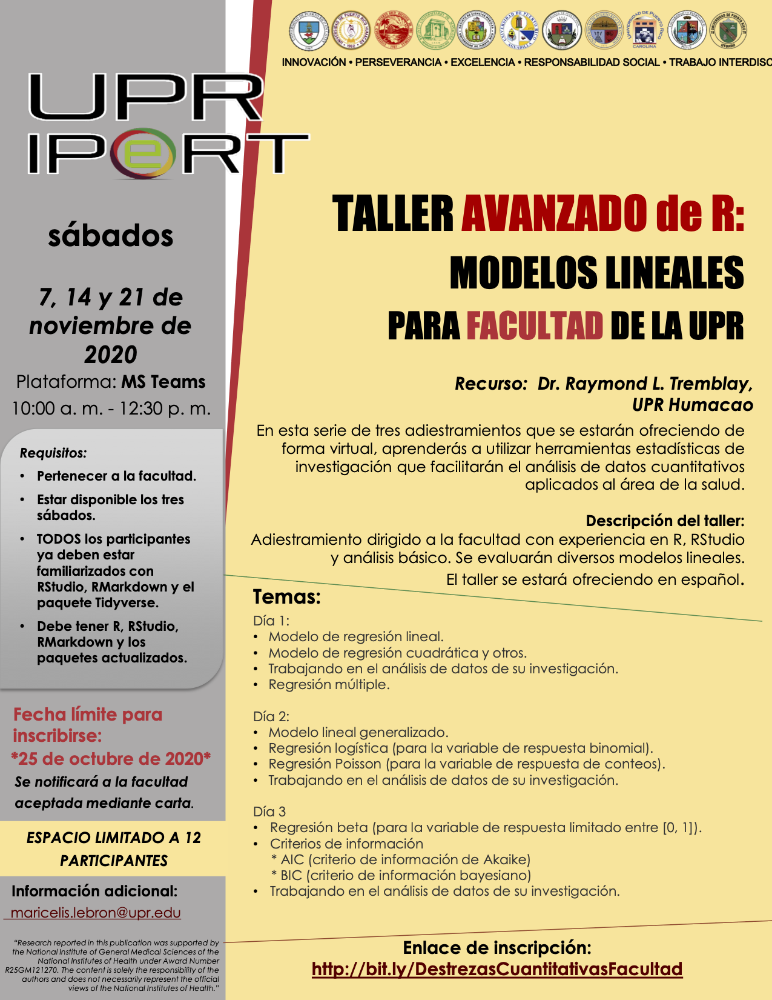

<style>
.list-group-item.active, .list-group-item.active:focus, .list-group-item.active:hover {
    background-color: #437d66;
}
</style>
```{r setup, include=FALSE}
knitr::opts_chunk$set(echo = TRUE)
```

```{r, echo=FALSE, fig.show = "hold", out.width = "50%", fig.align = "default"}
knitr::include_graphics(c("Graficos/Analitica.png", "Graficos/UPR_IPERT_logo.png"))
```

***


> “Activities reported in this website was supported by the National Institute Of General Medical Sciences of the National Institutes of Health under Award Number R25GM121270. The content is solely the responsibility of the authors and does not necessarily represent the official views of the National Institutes of Health.”

# Taller de Analisis Cuantitativo para especialista


Limitado a 10 personas: 2:30 horas por día y luego reuniones individuales con los participantes para consulta personal.

***

## Taller virtual (plataforma MSTeam)

El plan es ofrecer el taller en noviembre (3 sábados: 2:30 horas).

## Tema: 
Objetivo del taller: Evaluar diferentes enfoques de modelos lineales que incluyen información sobre la construcción del modelo en R, supuestos de los modelos, comparación de modelos. TODOS los participantes ya deben estar familiarizados con Rstudio, RMarkdown y el paquete tidyverse. Este es un taller intermedio / avanzado sobre la aplicabilidad de los siguientes enfoques de modelos lineales. Se espera que todos los participantes tengan R, RStudio, RMarkdown y los paquetes actualizados. 


Temas a cubrir:

  1. Día 1:
      - Modelo de regresión lineal
      - Modelo de regresión cuadrática y otros
      - Trabajando en el análisis de datos de su investigación.


  2. Día 2:
      - Regresión múltiples
      - Modelo lineal generalizado
      - Regresión logística (para la variable de respuesta binomial)
      - Regresión de Poisson (para la variable de respuesta de conteos)
      - Trabajando en el análisis de datos de su investigación.
      
   3. Día 3
        - Regresión beta (para la variable de respuesta limitado entre [0, 1])
        - Criterio de información
            - AIC (criterio de información de Akaike)
            - BIC (criterio de información bayesiano)
        - Trabajando en el análisis de datos de su investigación.


***

# Horario: 

7, 14, 21 de noviembre de 2020. De 10 a 12:15 h.

Además, todos los participantes tendrán acceso a al menos una consulta privada individual para su propia investigación para evaluar el método estadístico utilizado y los enfoques de visualización. Hora y fecha a coordinar con el R. L. Tremblay (preferiblemente tardes y fines de semana). 

***


```{r, echo=FALSE, fig.show = "hold", out.width = "50%", fig.align = "center"}

```


```{r, echo=FALSE, fig.show = "hold", out.width = "100%", fig.align = "default"}
knitr::include_graphics(c("Graficos/UPR_logos.png"))
```

